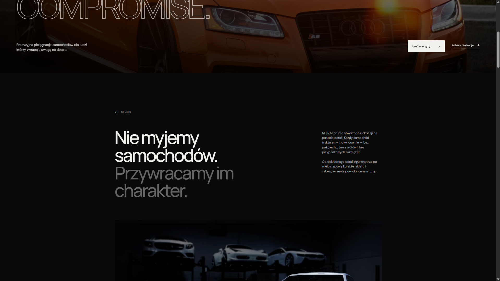

# NOIR Auto Detailing

Premium landing page for a fictional automotive detailing studio based in Wrocław, Poland.

Designed as a portfolio project with a strong focus on typography, visual hierarchy, responsive layout and subtle interactions.

## Live Demo

**[View live website](https://zenviamediakontakt-hub.github.io/noir-auto-detailing/)**

## Preview



## About the project

NOIR Auto Detailing is a fictional premium car detailing studio.

The website was designed around a minimal, dark automotive aesthetic with oversized typography, large photography and a contrasting lime accent.

Unlike a typical template-based business landing page, the layout uses asymmetric sections, editorial-style typography and restrained animations to create a more distinctive visual identity.

## Features

- Responsive desktop and mobile layout
- Full-screen automotive hero section
- Mobile navigation
- Scroll reveal animations
- Services section
- Asymmetric project gallery
- Detailing process section
- Interactive quote form demo
- Local AVIF image assets
- Responsive typography
- Reduced-motion support
- Custom favicon

## Technologies

- HTML5
- CSS3
- JavaScript
- Intersection Observer API
- GitHub Pages

No frameworks or UI libraries were used.

## Project structure

```text
noir-auto-detailing/
├── assets/
│   ├── images/
│   │   ├── hero.avif
│   │   ├── studio.avif
│   │   ├── porsche.avif
│   │   ├── ferrari.avif
│   │   ├── mercedes.avif
│   │   └── lamborghini.avif
│   └── preview.png
├── favicon.svg
├── index.html
├── style.css
├── script.js
└── README.md
```

## Running locally

No installation or build process is required.

Clone the repository and open:

```text
index.html
```

in your browser.

## Contact form

The quote form is included as an interactive frontend demonstration.

It validates the required fields and displays a simulated submission state, but it does not send or store any data.

## Disclaimer

This is a fictional project created for portfolio purposes.

NOIR Auto Detailing, its address, contact information, statistics and showcased services are demonstration content and do not represent a real business.
